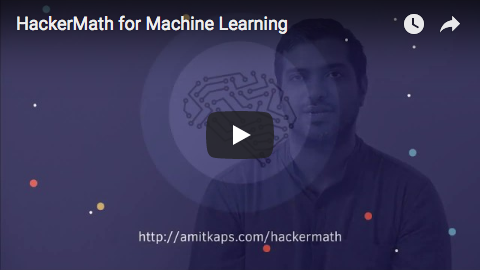

# HackerMath for Machine Learning

> “Study hard what interests you the most in the most undisciplined, irreverent and original manner possible.”
― Richard Feynman

Math literacy, including proficiency in Linear Algebra and Statistics,is a must for anyone pursuing a career in data science. The goal of this workshop is to introduce some key concepts from these domains that get used repeatedly in data science applications. Our approach is what we call the “Hacker’s way”. Instead of going back to formulae and proofs, we teach the concepts by writing code. And in practical applications. Concepts don’t remain sticky if the usage is never taught.

The focus will be on depth rather than breadth. Three areas are chosen - Hypothesis Testing, Supervised Learning and Unsupervised Learning. They will be covered to sufficient depth - 50% of the time will be on the concepts and 50% of the time will be spent coding them.

*More details at [http://amitkaps.com/hackermath](http://amitkaps.com/hackermath)*

See it in action: 

## Module #1: Hypothesis Testing

*Math Concepts*

- Basic Metrics: Mean, Variance, Covariance, Correlation
- Discrete Probability Distributions: Bernoulli, Binomial
- Cumulative Mass Function, Probability Mass Function
- Continuous Probability Distributions: Poisson, Uniform, Normal, Beta, Gamma
- Cumulative Distribution Function, Probability Density Function

*ML Applications*

- Direct Simulation
- Shuffling
- Bootstrapping
- Application to A/B Testing

## Module #2: Supervised Learning

*Math Concepts*

- Basics of Matrix Operation
- Matrix Determinant, Inverse
- Basics of Linear Algebra
- Solve for `Ax=b` for `nxn`
- Solve for `Ax=b` for `nxp+1`

*ML Applications*

- Linear Regression
- L2 Regularization
- Gradient Descent
- Linear Classifier
- Logistic Regression

### Module #3: Unsupervised Learning

*Math Concepts*

- Matrix Projections
- Solve for `Ax=λx` for `nxn`
- Eigenvectors & Eigenvalues
- Distance in Vector Space

*ML Applications*

- Dimensionality Reduction
- Principle Component Analysis
- Cluster Analysis

## Target Audience

- Someone with a background in programming who wants to pick the math needed for data science and get a flavor for different data science problems
- Someone who is a beginner in data science or has been doing data analysis (at least using Excel at a minimum) and wants to pick skills to take the next step in their data science career

## Pre-requisites

- Having a basic understanding of linear algebra would help. And we know you may have forgotten all about it from your school or college days. So here is an amazing video playlist by @3blue1brown to learn [The Essence of Linear Algebra](https://www.youtube.com/playlist?list=PLZHQObOWTQDPD3MizzM2xVFitgF8hE_ab) in a very visual way.
- Also, a touch of calculus knowledge would make it also easier. So if you want to brush up your basic calculus skills, then @3blue1brown has another amazing video playlist to learn [The Essence of Calculus](https://www.youtube.com/playlist?list=PLZHQObOWTQDMsr9K-rj53DwVRMYO3t5Yr) in a very visual way.
- Programming knowledge is mandatory. You should, at the bare minimum, be able to write conditional statements, use loops, be comfortable writing functions and be able to understand code snippets and come up with programming logic. Since we will be using Python - brush up your basics there. Specifically, we expect you to know the first three sections from this: [http://anandology.com/python-practice-book/](http://anandology.com/python-practice-book/)

## Software Requirements

You will require the Python data stack for the workshop. Please install Ananconda for Python 3.5 for the workshop. That has everything we need for the workshop. For attendees more curious, we will be using Jupyter Notebook as our IDE. We will be introducing numpy, scipy, seaborn, matplotlib, plotnine, statsmodel and scikit-learn.

The working repo for this workshop is at [https://github.com/amitkaps/hackermath/](https://github.com/amitkaps/hackermath/)

---

**Authors:**

[Amit Kapoor](https://twitter.com/amitkaps/)

[Bargava Subramanian](https://twitter.com/bargava/)
